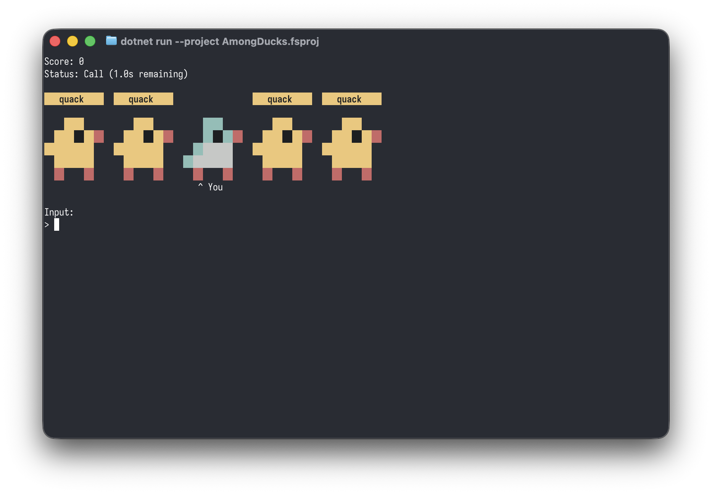

# Among Ducks

Among Ducks is a command-line reaction and typing game written in F# for .NET 10. You are a goose hiding among four ducks at KAIST. When the ducks make a call, type the exact same call and press Enter within 2 seconds to survive and increase your score.



## Requirements

- .NET 10 SDK
- A terminal that supports interactive keyboard input

## How to Run

From the repository root:

```sh
dotnet run --project AmongDucks.fsproj
```

The game starts with a 2-second cooldown. After that, duck call events may start while the status is `Waiting`. During a `Call`, type the displayed duck call exactly, including lowercase letters only and no leading or trailing spaces, then press Enter within 2 seconds.

After game over, enter `restart` to start again or `quit` to exit.

## Requirement Changes

The proposal specified ASCII art for ducks and the goose. During implementation, the ducks and goose were difficult to distinguish clearly using ASCII art alone, especially when the player had to react quickly to duck-call events. For this reason, the game uses colored terminal pixel art by default on terminals that support ANSI styling. A plain ASCII-art fallback is still provided when color is disabled or unsupported. This is only a visual presentation change; the gameplay rules, animal arrangement, player marker, duck-call behavior, timing, scoring, restart, and quit behavior are unchanged.
